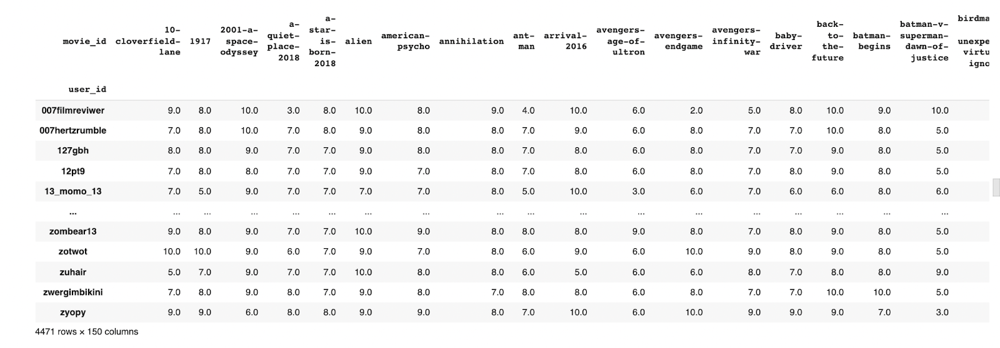
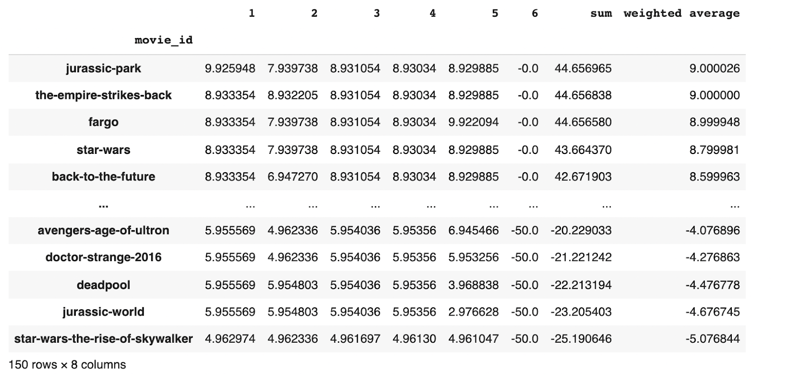
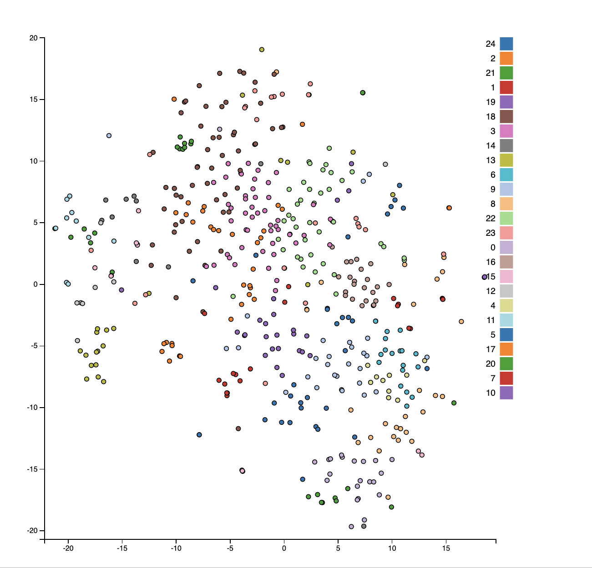
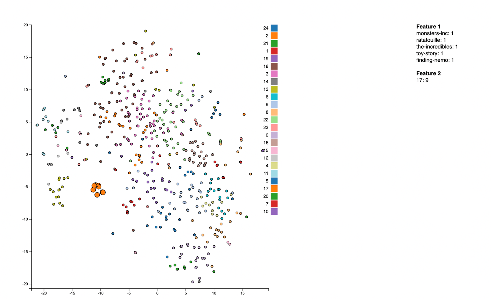
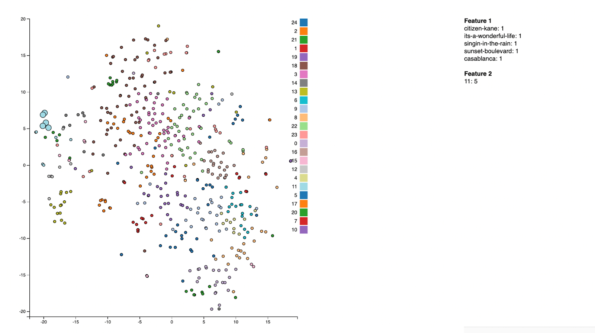
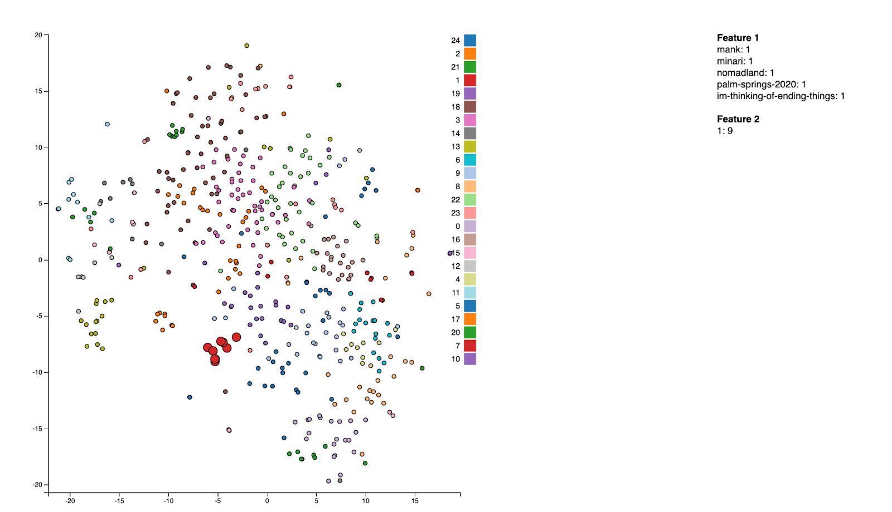
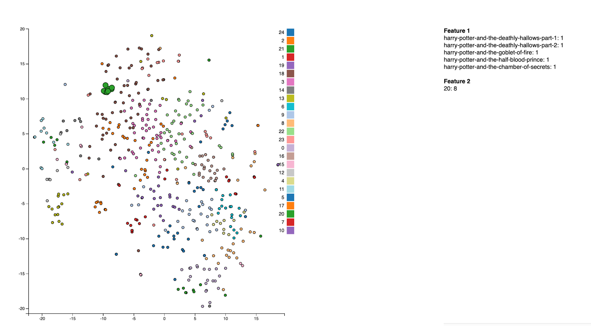
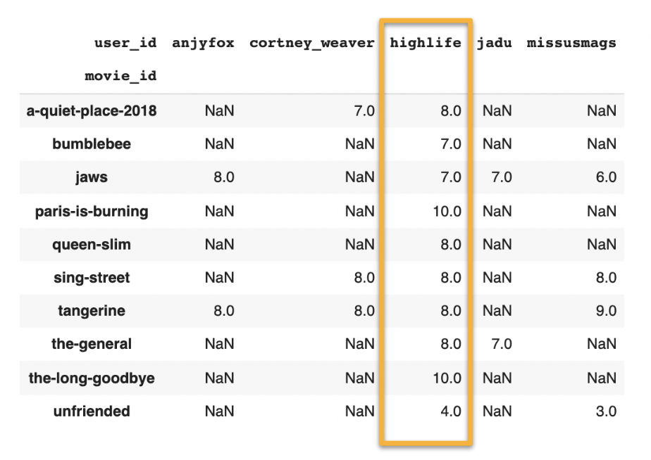
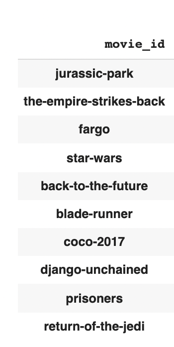
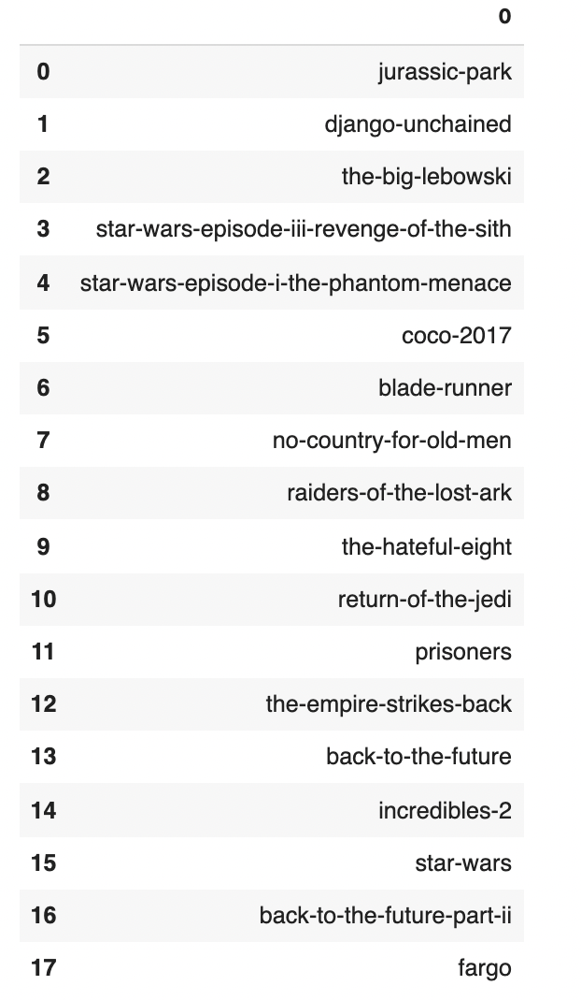

# A Movie Recommendation System
A movie recommendation system for my Data 144 final project at University of California, Berkeley.

## Motivation
**Real World Applications**
Recommendation systems have become an integral part of our daily routines, from suggesting new movies and TV shows to watch on Netflix, to curating personalized playlists on Spotify. These intelligent algorithms analyze our past viewing and listening habits, and use that information to present us with tailored recommendations that we're more likely to enjoy. As a result, recommendation systems have become an invaluable tool for companies looking to provide a more engaging and personalized experience for their customers.

**Personal Interests**
Recommendation systems have become such a ubiquitous presence in our daily lives that we often don't even realize they're there. From Netflix to Amazon, these powerful algorithms are constantly analyzing our preferences and recommending content that they think we'll enjoy. Therefore, I'd like to create my own recommendation system that could provide users with recommendations for the latest movies using only non-invasive data from a user.

**Practice Various Approaches**
Creating a recommendation system offers the perfect opportunity for me to put the data science skills I've learned in Data 144 into practice in a challenging, yet enjoyable manner. This project will allow me to work with real-world data and apply the concepts I've learned in class to solve a practical problem. Not only will this be a rewarding learning experience, but it will also give me the chance to build a useful tool that has the potential to benefit others by providing personalized recommendations.

## Why Recommendation Systems?
Movie recommendation systems, and indeed recommendation systems of all kinds, have become a staple in today's digital landscape and are a highly profitable tool for companies. By providing personalized recommendations to users, businesses are able to keep them engaged and encourage them to consume more products, leading to increased customer retention and sales. This is evident in the success of companies like Netflix, Amazon, and Spotify, who have all implemented effective recommendation systems. Inspired by these industry giants, I decided to try my hand at building my own recommendation system. I was eager to understand how these larger companies were able to create such accurate and effective recommendations and wanted to see if I could create a similar model on a smaller scale. My goal was to develop a recommendation system that, while perhaps not as complex as those used by major corporations, could still be useful for smaller companies that may not have the same level of computational resources at their disposal.

## Goal
**Can I recommend movies to a user based on their similarity to other users?**
I want to:
1. Predict the current trending movies
2. Find users that are similar to each other and find movies to recommend
3. Cluster movies based on their similarities

## Data
The data is obtained from a [open dataset](https://www.kaggle.com/datasets/samlearner/letterboxd-movie-ratings-data) on Kaggle. This dataset contains scraped, publicly accessible ratings data from Letterboxd, a popular film review and rating site.

The dataset consists of three CSV files. movie_data.csv, **ratings_export.csv**, and users_export.csv. I focused on using the ratings_export.csv file for this project. The granularity of the data is a rating by a single user for a single film. There are approximately 8.5 million data points, 250,000 movies, and 4500 users. The ratinsg range from [1, 10], where each increment represents half a star rating i.e. 1 = 0.5 star rating and 10 = 5 star rating.

## Method: Clustering of Users
One of the key challenges in creating a recommendation system is finding users who are similar to the target user. Unfortunately, I don't have access to personal or demographic information about the users, such as their age or gender. To overcome this limitation, I decided to take a different approach. By analyzing the ratings that users have given to the top 150 most popular movies on Letterboxd, I can get a sense of their taste in films and the types of movies they might enjoy. For example, if a user has rated a large number of thrillers highly, it's likely that they enjoy that genre and would be interested in similar films. By using this approach, I can identify other users who have similar tastes based on their ratings of common movies. Then, I can recommend to the target user the top-rated films from these similar users that they have not yet watched. This way, I can provide personalized recommendations to users without needing to know specific details about their demographics or personal preferences.

The pivot table below shows the ratings that each user has given to each movie. NULL values in the table represent films that a particular user has not yet watched. To approximate the user's potential rating for these films, I have filled in the NULL values with the average rating of the film, rounded to the nearest integer. This allows me to get a rough sense of how a user might rate a film that they have not yet seen based on the ratings given by other users.

To find users who are similar to the target user and recommend movies to them, I used a technique called cosine similarity. In this approach, I treated each user as a vector with 150 dimensions, corresponding to their ratings for the top 150 most popular movies. Using cosine similarity, I was able to identify the top 5 vectors (users) that were most similar to the target user. I then weighted each of these vectors based on their similarity to the target user, with more similar users receiving higher weights. To ensure that I only recommended movies that the target user had not yet watched, I applied a mask to the data and filtered out any movies that had already been watched by the target user. To further refine the recommendations, I used a weighted average to sort the movies and selected the top 10 highest-rated films. Specifically, I used a 0/1 value system, where 0 represented a movie that had not yet been watched and 1 represented a movie that had been watched. These values were then multiplied by -50 to give a negative weight to movies that the target user had already watched, helping to prioritize unwatched films in the final recommendation list. The table below illustrates the new weights added under column 6.

## Method: Clustering of Movies
As an alternative to finding similar users, I also considered the possibility of clustering movies based on their ratings by different users. This approach is based on the assumption that most users have certain general tastes or preferences - for example, someone who enjoys thriller movies is likely to also enjoy other thriller movies, while someone who dislikes slow films will probably also dislike other slow films. By clustering movies in this way, I can recommend movies that are in the same cluster as a film that a user has already rated highly. To implement this approach, I narrowed the dataset to the top 500 most watched movies and used a KNN (K nearest neighbors) clustering algorithm to group the movies into 25 clusters. To visualize the results of the clustering and assess the performance of the model, I used t-SNE (t-Distributed Stochastic Neighbor Embedding) dimensionality reduction to project the data onto a 2-D graph. This allowed me to see how the movies were distributed within the clusters and how well the model was able to distinguish between different types of films.

Below is a visualization of the clusters colored by feature 2. To ensure that the clusters are working as intended, let's take a closer look at each cluster.

**Pixar Animation Cluster**

**Old Black/White Classics**

**New 2020 Films**

**Harry Potter Series**

## Demonstration
To demonstrate the effectiveness of the clustering approach, I randomly selected a user, "highlife," and used the clustering model to find the top 10 movies that were liked by users similar to "highlife" and had not yet been watched by "highlife." The table below shows some of the film ratings that the user "highlife" has given.

The table below shows the top 10 movies that are liked by users similar to "highlife".

I then used the movie clusters to expand this list with additional recommendations. To do this, I selected the top 10 movies and found 5 movies that were similar to each one, based on their cluster membership. I then filtered out any duplicates and movies that had already been watched by "highlife," resulting in the final recommendation list.

Overall, this approach allowed me to provide personalized recommendations to "highlife" that were based on the ratings of similar users and the similarity of the recommended movies to films that "highlife" had already rated highly.

## Strengths
The project has several strengths that make it an effective and practical solution for providing personalized movie recommendations. One key strength is its scalability - the system is able to handle large amounts of data and can improve in accuracy as the data size increases. This makes it suitable for use with a wide range of datasets and user groups.

Another advantage of the project is its applicability - given a set of ratings from a user, the recommendation system can provide personalized recommendations without requiring any other personal or demographic information. This makes it a non-invasive solution that respects the privacy of users.

Finally, the recommendation system has a low barrier of entry, making it accessible and easy to use for a wide range of users. These strengths make the project a valuable tool for providing personalized movie recommendations to a diverse group of users.

## Limitations
There are a few limitations to the recommendation system that should be considered. One limitation is that the system may not perform as well for users who have already watched a significant portion of the films on the top 150 movie list. In these cases, it can be difficult to provide recommendations for highly rated movies that the user has not yet watched. To improve the system's performance in these cases, I may need to incorporate a larger number of movies into the dataset - both for clustering and for recommendations. 

Another limitation is that I don't currently have a good metric for measuring the performance of the recommendation system. To address this issue, I may need to gather feedback data from users after they have watched the recommended movies to see how well the system is performing. 

During the data cleaning process, I faced a decision about how to handle unrated movies. I considered leaving the values at 0 or replacing them with the global average rating for the film. I ultimately chose to use the global average rating, which resulted in higher cosine similarity scores, but I recognize that this approach has its own drawbacks, such as potentially masking the lack of ratings for certain films by certain users. This is something that I could have explored further to see if there is a better approach.

## Future Work
During the development of the recommendation system, I explored a number of different approaches and techniques. One of the ideas I considered was using singular value decomposition (SVD), a form of dimensionality reduction, to model the relationship between users and individual movies. While this model allowed me to retain a large amount of movie information (over 8.5 million data points), it also required a significant amount of computational resources, with a runtime of around 1 hour and relatively high RMSE values. 

I also looked at the possibility of combining SVD model predictions with similar user ratings and similar movie ratings, and then training a neural network to predict user ratings for each movie. However, the computational demands of this approach were even greater, with a projected runtime of around 5 hours just to build the training set. 

Another option I considered was using a skip-gram model, which could make recommendations based on information such as the actors and directors included in the movies. 

Ultimately, I decided to focus on the approaches that offered the best balance of accuracy and computational efficiency.

## Author

